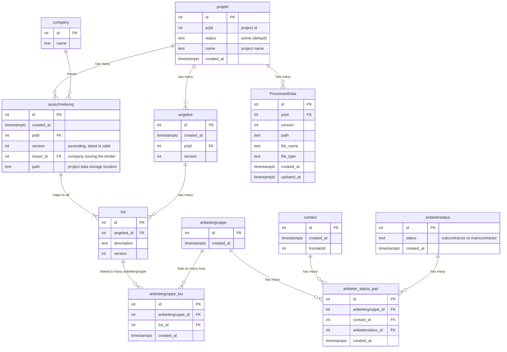

```mermaid
erDiagram
    projekt {
        int id PK
        int prjid "project id"
        text status "active (default)"
        text name "project name"
        timestamptz created_at
    }
    angebot {
        int id PK
        timestamptz created_at
        int prjid FK 
        int version
    }
    ausschreibung {
        int id PK
        timestamptz created_at
        int prjid FK 
        int version "ascending, latest is valid"
        int issuer_id FK "company issuing the tender"
        text path "project data storage location"
    }
    los {
        int id PK
        int angebot_id FK
        text description
        int version
    }
    anbietergruppe {
        int id PK
        timestamptz created_at
    }
    anbietergruppe_los {
        int id PK
        int anbietergruppe_id FK
        int los_id FK
        timestamptz created_at
    }
    contact {
        int id PK
        timestamptz created_at
        int KontaktId
    }
    anbieter_status_pair {
        int id PK
        int anbietergruppe_id FK
        int contact_id FK
        int anbieterstatus_id FK
        timestamptz created_at
    }
    anbieterstatus {
        int id PK
        text status "subcontractor or maincontractor"
        timestamptz created_at
    }
    company {
        int id PK
        text name
    }
    ProcessedData {
    int id PK
    int prjid FK
    int version
    text path
    text file_name
    text file_type
    timestamptz created_at
    timestamptz updated_at
}

projekt ||--o{ ProcessedData : "has many"
    projekt ||--o{ angebot : "has many"
    projekt ||--o{ ausschreibung : "has many"
    ausschreibung ||--|{ los : "maps to all"
    company ||--o{ ausschreibung : "issues"
    angebot ||--o{ los : "has many"
    los ||--o{ anbietergruppe_los : "linked to many anbietergruppe"
    anbietergruppe ||--o{ anbietergruppe_los : "bids on many lose"
    anbietergruppe ||--o{ anbieter_status_pair : "has many"
    contact ||--o{ anbieter_status_pair : "has many"
    anbieterstatus ||--o{ anbieter_status_pair : "has many"
```